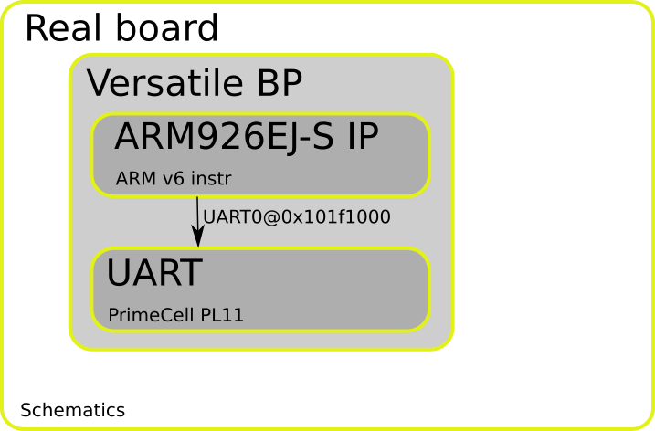
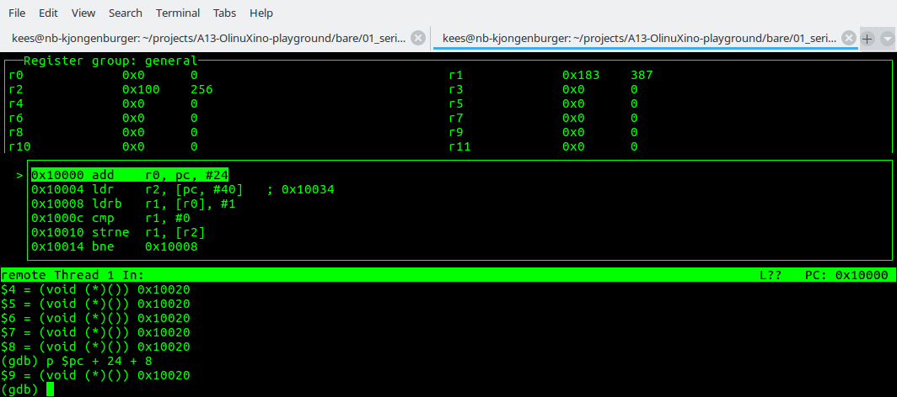

# title: ARM Bare bones





## The serial hello world


```

        .text	@ tell the assembler this is a text section. 
        adr r0,hello
        ldr r2, = UART0_BASE
    write:  
        ldrb r1 , [r0] , #1  @  r1 = *r0++

        cmp r1,#0
        strne r1, [r2] @ write to the UART not even waiting for the buffer 
                @ to be empty.
        bne write
        b end
    end:
        b end
        .align
    hello:
        .string "Hello,from Qemu\n"
        .equ    UART0_BASE,0x101f1000 @define a constant that points to the UART register
```


## Assemble


```
arm-none-eabi-as -o uart.o uart.S
arm-none-eabi-objdump -S uart.o
```

```
        uart.o:     file format elf32-littlearm


        Disassembly of section .text:

        00000000 <write-0x8>:
        0:	e28f0018 	add	r0, pc, #24
        4:	e59f2028 	ldr	r2, [pc, #40]	; 34 <hello+0x14>

        00000008 <write>:
        8:	e4d01001 	ldrb	r1, [r0], #1
        c:	e3510000 	cmp	r1, #0
        10:	15821000 	strne	r1, [r2]
        14:	1afffffb 	bne	8 <write>
        18:	eaffffff 	b	1c <end>

        0000001c <end>:
        1c:	eafffffe 	b	1c <end>

        00000020 <hello>:
        20:	6c6c6548 	.word	0x6c6c6548
        24:	72662c6f 	.word	0x72662c6f
        28:	51206d6f 	.word	0x51206d6f
        2c:	0a756d65 	.word	0x0a756d65
        30:	00000000 	.word	0x00000000
        34:	101f1000 	.word	0x101f1000
```


## Link

```
arm-none-eabi-ld -Ttext=0x10000 -o out.elf uart.o 
arm-none-eabi-objdump -S out.elf
```

```
        out.elf:     file format elf32-littlearm


        Disassembly of section .text:

        00010000 <write-0x8>:
        10000:	e28f0018 	add	r0, pc, #24
        10004:	e59f2028 	ldr	r2, [pc, #40]	; 10034 <hello+0x14>

        00010008 <write>:
        10008:	e4d01001 	ldrb	r1, [r0], #1
        1000c:	e3510000 	cmp	r1, #0
        10010:	15821000 	strne	r1, [r2]
        10014:	1afffffb 	bne	10008 <write>
        10018:	eaffffff 	b	1001c <end>

        0001001c <end>:
        1001c:	eafffffe 	b	1001c <end>

        00010020 <hello>:
        10020:	6c6c6548 	.word	0x6c6c6548
        10024:	72662c6f 	.word	0x72662c6f
        10028:	51206d6f 	.word	0x51206d6f
        1002c:	0a756d65 	.word	0x0a756d65
        10030:	00000000 	.word	0x00000000
        10034:	101f1000 	.word	0x101f1000
```


## Strip

```
arm-none-eabi-strip out.elf 
arm-none-eabi-objdump -S uart.elf 
```

```
	uart.elf:     file format elf32-littlearm


	Disassembly of section .text:

	00010000 <.text>:
	   10000:	e28f0018 	add	r0, pc, #24
	   10004:	e59f2028 	ldr	r2, [pc, #40]	; 0x10034
	   10008:	e4d01001 	ldrb	r1, [r0], #1
	   1000c:	e3510000 	cmp	r1, #0
	   10010:	15821000 	strne	r1, [r2]
	   10014:	1afffffb 	bne	0x10008
	   10018:	eaffffff 	b	0x1001c
	   1001c:	eafffffe 	b	0x1001c
	   10020:	6c6c6548 	cfstr64vs	mvdx6, [ip], #-288	; 0xfffffee0
	   10024:	72662c6f 	rsbvc	r2, r6, #28416	; 0x6f00
	   10028:	51206d6f 			; <UNDEFINED> instruction: 0x51206d6f
	   1002c:	0a756d65 	beq	0x1d6b5c8
	   10030:	00000000 	andeq	r0, r0, r0
	   10034:	101f1000 	andsne	r1, pc, r0

```

## Convert to bin

```
arm-linux-gnueabi-objcopy -O binary uart.elf uart.bin
hexdump -e '4/1 "%02X "' -e '"\n"' uart.bin
```

```
	18 00 8F E2
	28 20 9F E5
	01 10 D0 E4
	00 00 51 E3
	00 10 82 15
	FB FF FF 1A
	FF FF FF EA
	FE FF FF EA
	48 65 6C 6C
	6F 2C 66 72
	6F 6D 20 51
	65 6D 75 0A
	00 00 00 00
	00 10 1F 10
	00 00 00 00
	*
	04 00 00 00
	14 00 00 00
	03 00 00 00
	47 4E 55 00
	B7 A6 BE 0C
	09 2C 2B 2F
	D6 B7 E1 9E
	BC E2 47 18
	01 55 E8 9D
```


## Execute

```
qemu-system-arm -M versatilepb -m 128M -nographic  -kernel uart.bin
```

```
Hello,from Qemu
```

----


## Step through

```
qemu-system-arm -M versatilepb -m 128M -nographic  -kernel uart.bin -s -S
arm-none-eabi-gdb uart.elf 
```




## Instruction & Encoding

[Instruction set](http://infocenter.arm.com/help/topic/com.arm.doc.qrc0001l/QRC0001_UAL.pdf)
[Instruction encoding](http://infocenter.arm.com/help/index.jsp?topic=/com.arm.doc.ddi0210c/CACCCHGF.html)


## Checklist

* Talking about the ARM 32 bits instruction set
* Load store archtitecture
* Relatively simple instruction set
* Fixed length
* Conditional execution
* Automatic index increment
* Direct addressing
* Indirect addressing
* SWI (aka system call)
* No BIOS type functionality
* Direct IO (no ioport)
* There are also CP instructions


## Next step

* More examples (headers, stack and hacking?)


## Resources

Code as presented 

* https://github.com/keesj/A13-OlinuXino-playground/tree/versatilepb
* http://bravegnu.org/gnu-eprog/
* https://microcorruption.com/ (to learn about stuff in general)
