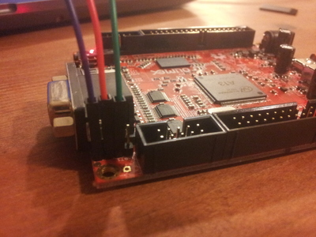
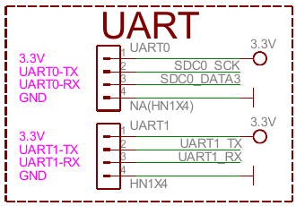

# 13-OlinuXino-MICRO info

I recently purchased a 13-OlinuXino-MICRO. The goal is to port MINIX to that board. I therefore am gattering some information here.
Document

Datasheets:

* User manual: http://dl.linux-sunxi.org/A13/A13%20User%20Manual%20-%20v1.2%20(2013-01-08).pdf

Links:

* [Schematics and some software including script.bin](git://github.com/OLIMEX/OLINUXINO.git "OLIMEX git repo")
* [sunxi Linux Kernel](https://github.com/linux-sunxi/linux-sunxi.git)
* [u-boot](https://github.com/linux-sunxi/u-boot-sunxi.git)
* [sunxi tools](git://github.com/linux-sunxi/sunxi-tools.git)
* [FreeBSD port to the a10](git://github.com/tsgan/allwinner_a10.git)


## Serial and serial cable

If you have the link:https://www.olimex.com/Products/Components/Cables/USB-Serial-Cable/USB-Serial-Cable-F/[Olimex USB-SERIAL-CABLE] GND=BLUE, RX(INPUT)=GREEN, TX(OUTPUT)=RED you can connect it the following way:





As usual with serial you need to connect the sending end of the serial to the receiving end of the board.

## Formating the SD-card

The device doesn't have internal storage and boots from the SD-card. The second and third stage loader (SPL and U-Boot) are loaded from the start of the MMC (not on a file system). The default configuration is to create two partitions the first is a FAT formatted one where u-boot will load files from and the second one probably a ext2 partition. But given the bootloaders are not on the FAT you need to reserve some space at the start (I leave 2048 512 byte blokcs at the start as this is the default fdisk offers).

The layout looks something like this:

| *NAME*           |  start block | size
| MBR              |  0 | 1 block
| sunxi-spl.bin    | 16 | 20K
| u-boot.bin       | 64 | 170K
| FAT              | 2048 | 20M
| EXT2             | --- | Rest


fisk -l on your device might look like this:
```
---------------------------------
    Device Boot      Start         End      Blocks   Id  System
 /dev/sdc1            2048       43007       20480    b  W95 FAT32
 /dev/sdc2           43008      990975      473984   83  Linux
---------------------------------
```

## Uboot and booting

```
 git clone https://github.com/linux-sunxi/u-boot-sunxi.git
 cd u-boot-sunxi
 make a13_olinuxino CROSS_COMPILE=arm-none-eabi-
 DEV=/dev/sdXFixMe
 sudo dd if=spl/sunxi-spl.bin of=$DEV bs=1024 seek=8
 sudo dd if=u-boot.bin of=$DEV bs=1024 seek=32
```

Afther this the device will boot and if you have a serial attached you can see the u-boot command prompt


## Kernel and script.bin

script.bin is file used by the sunxi kernel and contains configuration parameters like port GPIO assignments. This file file is created using the fex2bin tool  that can be found in the sunxi-tools git repo. You can convert the bin file into something more readable using bin2fex. If you run that you get link:src/script.bin.fex[Ascii version of script.bin].

