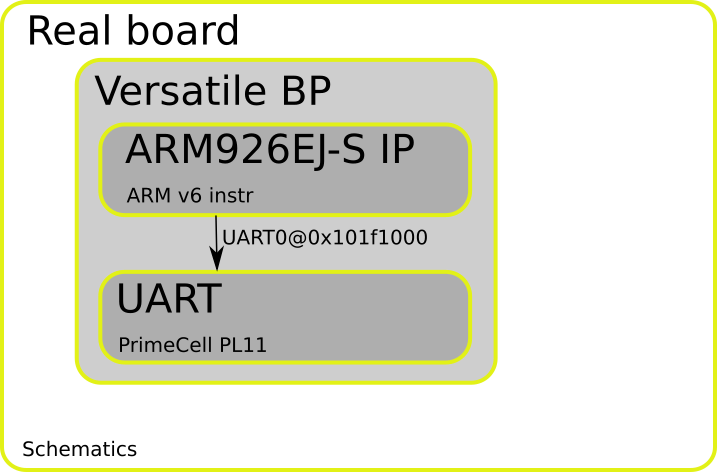
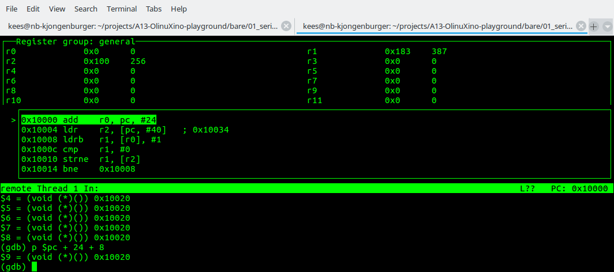

:data-transition-duration: 500
:skip-help: true

.. title: ARM Bare bones


----




----

The serial hello world
======================


.. code-block:: arm

        .text	@ tell the assembler this is a text section. 
        adr r0,hello
        ldr r2, = UART0_BASE
    write:  
        ldrb r1 , [r0] , #1  @  r1 = *r0++

        cmp r1,#0
        strne r1, [r2] @ write to the UART not even waiting for the buffer 
                @ to be empty.
        bne write
        b end
    end:
        b end
        .align
    hello:
        .string "Hello,from Qemu\n"
        .equ    UART0_BASE,0x101f1000 @define a constant that points to the UART register


----

Assemble
========


* arm-none-eabi-as -o uart.o uart.S
* arm-none-eabi-objdump -S uart.o

.. code-block:: c-objdump

        uart.o:     file format elf32-littlearm


        Disassembly of section .text:

        00000000 <write-0x8>:
        0:	e28f0018 	add	r0, pc, #24
        4:	e59f2028 	ldr	r2, [pc, #40]	; 34 <hello+0x14>

        00000008 <write>:
        8:	e4d01001 	ldrb	r1, [r0], #1
        c:	e3510000 	cmp	r1, #0
        10:	15821000 	strne	r1, [r2]
        14:	1afffffb 	bne	8 <write>
        18:	eaffffff 	b	1c <end>

        0000001c <end>:
        1c:	eafffffe 	b	1c <end>

        00000020 <hello>:
        20:	6c6c6548 	.word	0x6c6c6548
        24:	72662c6f 	.word	0x72662c6f
        28:	51206d6f 	.word	0x51206d6f
        2c:	0a756d65 	.word	0x0a756d65
        30:	00000000 	.word	0x00000000
        34:	101f1000 	.word	0x101f1000

----

Link
====

* arm-none-eabi-ld -Ttext=0x10000 -o out.elf uart.o 
* arm-none-eabi-objdump -S out.elf

.. code-block:: c-objdump

        out.elf:     file format elf32-littlearm


        Disassembly of section .text:

        00010000 <write-0x8>:
        10000:	e28f0018 	add	r0, pc, #24
        10004:	e59f2028 	ldr	r2, [pc, #40]	; 10034 <hello+0x14>

        00010008 <write>:
        10008:	e4d01001 	ldrb	r1, [r0], #1
        1000c:	e3510000 	cmp	r1, #0
        10010:	15821000 	strne	r1, [r2]
        10014:	1afffffb 	bne	10008 <write>
        10018:	eaffffff 	b	1001c <end>

        0001001c <end>:
        1001c:	eafffffe 	b	1001c <end>

        00010020 <hello>:
        10020:	6c6c6548 	.word	0x6c6c6548
        10024:	72662c6f 	.word	0x72662c6f
        10028:	51206d6f 	.word	0x51206d6f
        1002c:	0a756d65 	.word	0x0a756d65
        10030:	00000000 	.word	0x00000000
        10034:	101f1000 	.word	0x101f1000

----

Strip
=====

* arm-none-eabi-strip out.elf 
* arm-none-eabi-objdump -S uart.elf 

.. code-block:: c-objdump

	uart.elf:     file format elf32-littlearm


	Disassembly of section .text:

	00010000 <.text>:
	   10000:	e28f0018 	add	r0, pc, #24
	   10004:	e59f2028 	ldr	r2, [pc, #40]	; 0x10034
	   10008:	e4d01001 	ldrb	r1, [r0], #1
	   1000c:	e3510000 	cmp	r1, #0
	   10010:	15821000 	strne	r1, [r2]
	   10014:	1afffffb 	bne	0x10008
	   10018:	eaffffff 	b	0x1001c
	   1001c:	eafffffe 	b	0x1001c
	   10020:	6c6c6548 	cfstr64vs	mvdx6, [ip], #-288	; 0xfffffee0
	   10024:	72662c6f 	rsbvc	r2, r6, #28416	; 0x6f00
	   10028:	51206d6f 			; <UNDEFINED> instruction: 0x51206d6f
	   1002c:	0a756d65 	beq	0x1d6b5c8
	   10030:	00000000 	andeq	r0, r0, r0
	   10034:	101f1000 	andsne	r1, pc, r0


----

Convert to bin
==============

* arm-linux-gnueabi-objcopy -O binary uart.elf uart.bin
* hexdump -e '4/1 "%02X "' -e '"\n"' uart.bin

.. code-block:: c-objdump

	18 00 8F E2
	28 20 9F E5
	01 10 D0 E4
	00 00 51 E3
	00 10 82 15
	FB FF FF 1A
	FF FF FF EA
	FE FF FF EA
	48 65 6C 6C
	6F 2C 66 72
	6F 6D 20 51
	65 6D 75 0A
	00 00 00 00
	00 10 1F 10
	00 00 00 00
	*
	04 00 00 00
	14 00 00 00
	03 00 00 00
	47 4E 55 00
	B7 A6 BE 0C
	09 2C 2B 2F
	D6 B7 E1 9E
	BC E2 47 18
	01 55 E8 9D


----


Execute
=======

qemu-system-arm -M versatilepb -m 128M -nographic  -kernel uart.bin

```
Hello,from Qemu
```

----


Step through
============

qemu-system-arm -M versatilepb -m 128M -nographic  -kernel uart.bin -s -S
arm-none-eabi-gdb uart.elf 




----

Instruction & Encoding
======================

Instruction set
http://infocenter.arm.com/help/topic/com.arm.doc.qrc0001l/QRC0001_UAL.pdf

Instruction encoding
http://infocenter.arm.com/help/index.jsp?topic=/com.arm.doc.ddi0210c/CACCCHGF.html


----

Checklist
=========

* Talking about the ARM 32 bits instruction set
* Load store archtitecture
* Relatively simple instruction set
* Fixed length
* Conditional execution
* Automatic index increment
* Direct addressing
* Indirect addressing
* SWI (aka system call)
* No BIOS type functionality
* Direct IO (no ioport)
* There are also CP instructions


Next step
=========

* More examples (headers, stack and hacking?)


----

Resources
=========

Code as presented 

* https://github.com/keesj/A13-OlinuXino-playground/tree/versatilepb
* http://bravegnu.org/gnu-eprog/
* https://microcorruption.com/ (to learn about stuff in general)
